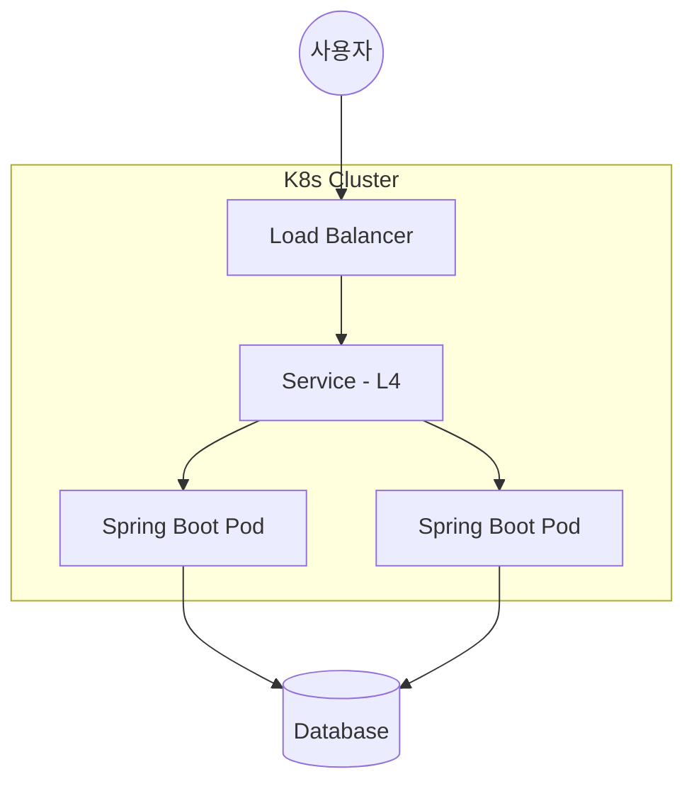

# 개발하기싫어요

안정적이고 확장 가능한 서버 아키텍처와 효율적인 데이터 처리를 위해 끊임없이 고민합니다. 안해요

---

**Backend**  

  

**Database & Cache**  

  

**Infrastructure**  

---

### Projects  임시작성용

#### **Velo (Aeranghae)** 
> AI 기반 코드 자동 생성 플랫폼

<b>상세 내용 및 기술적 성취 (클릭)</b>

**Architecture**

**주요 기술 내용**

* **개요:** Spring Boot와 LLM을 결합한 자연어 코드 생성 서비스
* **성능 최적화:** Redis 캐싱 도입으로 DB 조회 부하 30% 감소
* **인프라:** Docker & Kubernetes를 활용한 컨테이너 기반 배포 및 자동화
* **로드밸런싱:** 쿠버네티스 Service(L4)를 통한 트래픽 분산 및 가용성 확보

**🛠 Troubleshooting**

* **문제:** 대량의 코드 생성 요청 시 DB 조회 병목 발생
* **해결:** Redis 캐싱 전략 수립 (응답속도 200ms → 50ms 단축)

* **문제:** 업데이트 시 일시적 서비스 단절
* **해결:** 쿠버네티스 Deployment 롤링 업데이트 전략 설정으로 무중단 배포 달성

---

