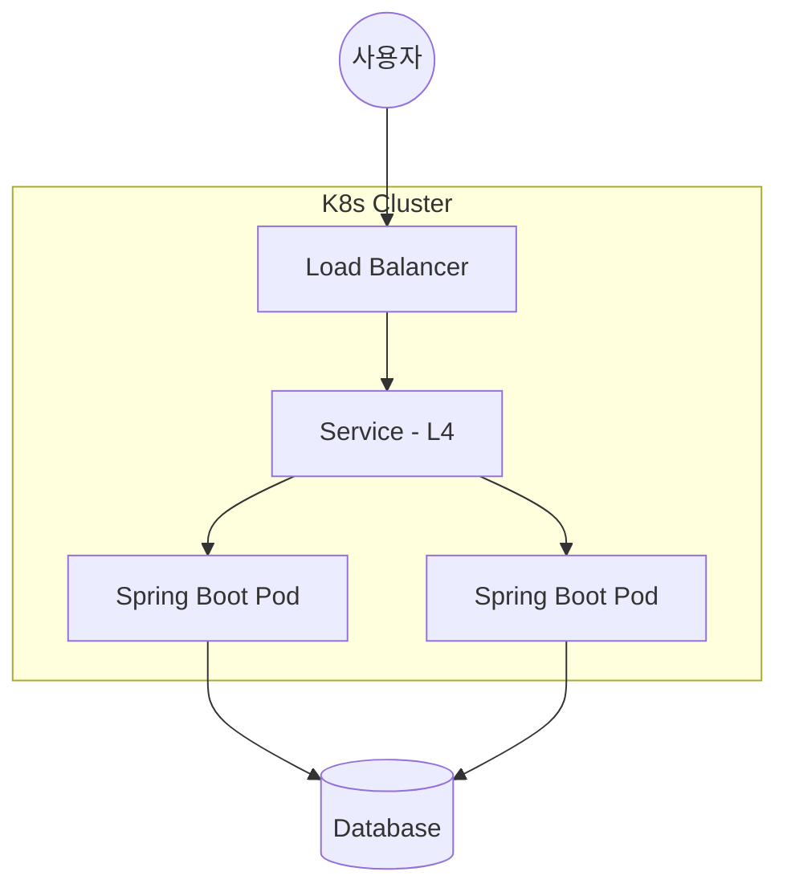

# 개발하기싫어요

안정적이고 확장 가능한 서버 아키텍처와 효율적인 데이터 처리를 위해 끊임없이 고민합니다. 안해요

---

**Backend**  

  

**Database & Cache**  

  

**Infrastructure**  

---

### Projects  임시작성용

#### **Velo (Aeranghae)** 
> AI 기반 코드 자동 생성 플랫폼

<b>상세 내용 및 기술적 성취 (클릭)</b>

**Architecture**

**주요 기술 내용**

* **개요:** Spring Boot와 LLM을 결합한 자연어 코드 생성 서비스
* **성능 최적화:** Redis 캐싱 도입으로 DB 조회 부하 30% 감소
* **인프라:** Docker & Kubernetes를 활용한 컨테이너 기반 배포 및 자동화
* **로드밸런싱:** 쿠버네티스 Service(L4)를 통한 트래픽 분산 및 가용성 확보

<b>🛠️ Troubleshooting (기술적 문제 해결 및 아키텍처 고민)</b>

 

#### 1. [Resource] 물리 경로와 논리 이름 분리를 통한 디렉토리 충돌 방지
- **문제 상황:** 사용자 설정 이름으로 스토리지 폴더 생성 시, 프로젝트명 변경에 따른 디스크 I/O 병목 및 동일 이름 프로젝트 간의 폴더 충돌 위협 발견.
- **해결책:** 물리 디렉토리는 고유 식별자(`UUID`)로 완전히 격리하고, 화면 표시용 이름은 DB 메타데이터로 매핑하는 구조적 분리(Decoupling)를 통해 물리-논리 아키텍처 무결성 확보.
- **결과:** 사용자가 프로젝트 이름을 자유롭게 변경하더라도 실제 파일 시스템의 경로가 깨지거나 파일이 유실되는 위험을 원천 차단함.

---

#### 2. [Security] 인프라 자원 보호를 위한 스토리지 할당 시점 제어
- **문제 상황:** 회원가입 절차를 마치지 않은 가상 사용자의 무분별한 유입 시 스토리지 공간이 무한 생성되어 서버 디스크 고갈(DoS) 위협 발생.
- **원인 분석:** OAuth 인증 직후 가입을 완료하지 않은 익명(`GUEST`) 유저에게까지 물리 스토리지를 무조건 할당하는 느슨한 자원 정책이 원인이었음.
- **해결책:** `if (user.getRole() == Role.USER)` 가드 조건을 비비즈니스 레이어에 매핑하여, 정식 유저 승급 시점에만 격리 샌드박스 공간을 할당하도록 자원 관리 정책 정교화.
- **결과:** 유령 폴더 생성을 막아 서버 리소스 낭비를 방지하고 악의적인 자원 고갈 공격 방어선을 구축함.

---

#### 3. [I/O Optimization] 실시간 디스크 전수 스캔 병목 개선
- **문제 상황:** 용량 및 구조 조회를 위해 매번 `Files.walk`로 파일 시스템을 실시간 전수 동기화 시 데이터 볼륨 증가에 따른 API 응답 속도 저하 우려.
- **해결책:** AI 자율 공정이 종결되는 시점에만 단 한 번 파일 트리와 용량을 일괄 색인(`indexProjectFiles`)하여 DB에 저장하고, 평소 조회 시에는 영속성 레이어의 캐시 메타데이터에서 즉시 서빙하도록 수정하여 디스크 I/O 부담 최소화.
- **결과:** 사용자 요청 시마다 디스크를 긁어오던 무거운 탐색을 배제하고, JPA 영속성 컨텍스트 레이어에서 0.0001초 만에 최신 메타데이터를 안정적으로 서빙함.

---

#### 4. [Data Integrity] 재귀적 디렉토리 파괴 알고리즘 구축
- **문제 상황:** 자바 표준 `Files.delete()`의 특성상 비어있지 않은 폴더 삭제가 불가능하여, 프로젝트 삭제 시 디스크에 찌꺼기 파일이 남는 데이터 불일치 현상 발생.
- **해결책:** 하위 데이터 노드부터 역순으로 탐색하여 리프 파일들을 선제 제거하는 `deleteDirectoryRecursive` 재귀 알고리즘을 구현하여 물리-논리 데이터 정합성 100% 일치 도달.
- **결과:** 프로젝트 삭제 요청 시 데이터베이스 장부와 물리 저장소 폴더가 완전히 일괄 소멸되는 정합성을 보장함.

---

#### 5. [Network] Spring Security와 CORS Preflight 필터 순서 꼬임 해결
- **문제 상황:** 리액트 클라이언트의 PATCH 등 일부 요청 시 CORS 가드에 막혀 `403 Invalid CORS request` 에러 연쇄 격발.
- **원인 분석:** 브라우저가 보안 검증을 위해 선제적으로 보내는 `OPTIONS (Preflight)` 요청은 인증 토큰을 지니지 않는데, `JwtFilter`가 `CorsFilter`보다 앞단에 배치되어 토큰 부재를 이유로 요청을 원천 차단했기 때문임.
- **해결책:** `JwtAuthenticationFilter`의 진입 포지션을 `CorsFilter` 뒷단으로 재배치하여, 토큰이 없는 Preflight 요청이 CORS 승인 헤더를 정상적으로 발급받아 통과할 수 있도록 필터 아키텍처 교정.
- **결과:** 복잡한 HTTP 메서드 요청 시 발생하던 인증 및 CORS 거부 문제를 완벽히 해결하여 프론트-백엔드 간 안정적인 통신 인프라를 확보함.

---

#### 6. [Data] Spring Data Redis 4.0 직렬화 빌더 패턴 대응 및 예외 방어
- **문제 상황:** Spring Data Redis 4.0 업그레이드에 따라 기존 구버전 기반의 `GenericJackson2JsonRedisSerializer` 및 `create()` 팩토리 메서드가 Deprecated되어 컴파일 예외 발생.
- **해결책:** 최신 가이드라인에 맞춰 `GenericJacksonJsonRedisSerializer.builder()` 패턴으로 전면 리팩토링을 단행하고, 객체 다형성 보장 시 발생할 수 있는 역직렬화 `ClassCastException`을 방어하기 위해 `BasicPolymorphicTypeValidator`를 통한 최상위 `Object.class` 타입 바인딩 커스텀 설정 완료.
- **결과:** 최신 릴리스 명세에 맞춘 안전한 인메모리 데이터 직렬화 환경을 구성하고 중복 생성되던 Serializer 객체를 빈으로 관리하여 재사용성을 높임.

---

#### 7. [Performance] AI 장기 빌드에 따른 웹소켓 세션 끊김 및 대용량 로그 버퍼 초과 현상 해결
- **문제 상황:** AI 에이전트가 코드를 자율 생성하고 격리 샌드박스 내부에서 Gradle 빌드 및 쉘 명령어를 실행하는 과정에서, 실시간 로그 스트리밍 도중 웹소켓 연결이 중간에 끊기거나 특정 대용량 로그 구간에서 데이터가 잘리는 현상 발생.
- **원인 분석:** 스프링 웹소켓의 기본 세션 유지 타임아웃 설정이 짧아 장기 연산 시 무동작 상태로 오인되었고, 동시에 쏟아지는 방대한 `stdout` 로그의 크기가 기본 텍스트 버퍼 용량을 초과하여 예외가 격발됨.
- **해결책:** `ServletServerContainerFactoryBean`을 활용해 웹소켓 세션 가동 및 비동기 송신 타임아웃을 **5분(300,000ms)**으로 상향 조정하고, 텍스트 및 바이너리 메시지 버퍼 크기를 **10MB**로 대폭 확장 체급 조정함.
- **결과:** 네트워크 병목이나 인프라 제약 없이 AI 자율 공정 전체 프로세스의 대용량 빌드 로그를 100% 무결하고 실시간으로 안정적인 스트리밍을 달성함.

---

